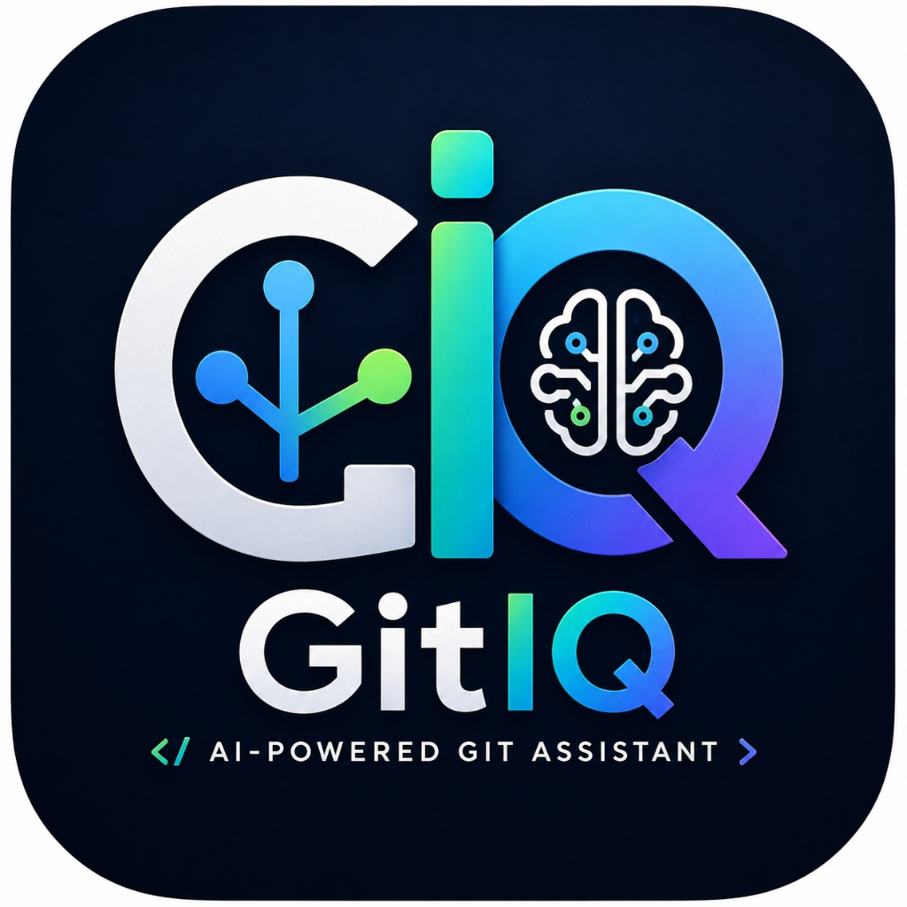

# GitIQ

AI-Powered Git Assistant for Visual Studio Code

---

*Transform your Git workflow with automated Conventional Commit generation, AI commit explanations, professional Pull Request creation, offline commit analytics, and seamless GitHub integration.*

---

## 📖 Overview

**GitIQ** is an extension for Visual Studio Code designed to elevate developer productivity and standardize version control practices. By inspecting your staged Git diffs and repository history, GitIQ automatically drafts concise, conventional commit messages and complete Pull Request documents using high-performance AI models powered by the **Groq API** (`llama-3.3-70b-versatile`).

In addition to AI capabilities, GitIQ features a suite of **offline Git tools**—including keyword search, commit statistics, 7-day activity tables, contributor rankings, and GitHub web shortcuts—operating instantly without remote API calls.

---

## 🎥 Demo

 ..

*Watch GitIQ generate conventional commit messages and pull requests in real time.*

---

## 📸 Screenshots

| Feature | Preview |
| :--- | :--- |
| **Home & Dashboard** |  |
| **AI Commit Generator** |  |
| **Commit History Explorer** |  |
| **Pull Request Helper** |  |
| **Secure Settings** |  |

---

## ✨ Key Features

### 🤖 AI-Powered Productivity
- **Conventional Commit Generator**: Drafts structured `feat:`, `fix:`, `refactor:`, `docs:`, `perf:` messages directly from your staged diffs (`git diff --cached`).
- **AI Commit Explanation**: Explains complex commits in plain English—summarizing purpose, affected files, major changes, and potential system impact.
- **AI Pull Request Helper**: Constructs complete, professional Pull Requests (Title, Summary, Detailed Description, Files Changed, Testing, Breaking Changes, Checklist) from branch diffs and commit histories.

### 📊 Offline Git History Analytics
- **Search Commit History**: Offline keyword search across your commit log (`git log --all --grep`).
- **Repository Statistics**: Computes total commits, today's commits, 7-day count, 30-day count, average commits/day, repo age, and branch status.
- **Top Contributors**: Ranks author commit counts using `git shortlog -sn`.
- **Commit Activity**: Generates 7-day commit distribution breakdown tables.
- **Export Report**: Saves a complete Markdown report (`commit-history-report.md`) directly to your workspace root.

### 🛡️ Security & Configuration
- **OS-Level Secret Storage**: Stores your API key safely in `vscode.SecretStorage`. Keys are never saved in plain text.
- **Automatic Migration**: Detects legacy setting keys and migrates them to secure storage with one click.
- **Groq Model Selector**: Switch between `llama-3.3-70b-versatile`, `llama-3.1-8b-instant`, `openai/gpt-oss-120b`, and `deepseek-r1-distill-llama-70b`.

---

## 🚀 Getting Started

### 1. Installation
Install GitIQ directly from the [VS Code Marketplace](https://marketplace.visualstudio.com/items?itemName=gitiq.gitiq) or search for `GitIQ` in the Extensions view (`Ctrl+Shift+X` / `Cmd+Shift+X`).

### 2. Configure Groq API Key
1. Obtain a free API key from [Groq Console](https://console.groq.com/).
2. Open the Command Palette (`Ctrl+Shift+P` / `Cmd+Shift+P`).
3. Run: `GitIQ: Set Groq API Key`.
4. Enter your key (`gsk_...`). It will be saved securely in VS Code `SecretStorage`.

### 3. Basic Usage
1. **Stage your changes**: `git add .`
2. **Generate Commit Message**: Run `GitIQ: Generate Commit Message`.
3. **Review & Confirm**: Edit the suggested message in the input box and press `Enter` to commit!

---

## 🛠️ Complete Commands Reference

| Command Title | Command ID | Description |
| :--- | :--- | :--- |
| `GitIQ: Hello` | `gitIQ.hello` | Health check command verifying extension activation. |
| `GitIQ: Check Git Repository` | `gitIQ.checkGitRepository` | Verifies whether the workspace is inside a Git repository. |
| `GitIQ: Preview Git Diff` | `gitIQ.previewGitDiff` | Opens read-only virtual diff document for staged changes (`git diff --cached`). |
| `GitIQ: Generate Commit Message` | `gitIQ.generateCommitMessage` | Analyzes staged changes with AI and presents editable commit box. |
| `GitIQ: View Commit History` | `gitIQ.viewCommitHistory` | Displays recent commits (`git log -n 20`) in QuickPick with details viewer. |
| `GitIQ: Explain Commit` | `gitIQ.explainCommit` | Generates a plain English AI explanation of any commit. |
| `GitIQ: Copy Commit Hash` | `gitIQ.copyCommitHash` | Copies selected commit hash to system clipboard. |
| `GitIQ: Push Branch` | `gitIQ.push` | Pushes current branch to remote origin with progress notification. |
| `GitIQ: Pull Branch` | `gitIQ.pull` | Pulls latest changes from remote origin with conflict detection. |
| `GitIQ: Fetch Updates` | `gitIQ.fetch` | Fetches remote references (`git fetch`). |
| `GitIQ: Show Current Branch` | `gitIQ.currentBranch` | Displays active checked-out branch name. |
| `GitIQ: Repository Information` | `gitIQ.repositoryInfo` | Opens read-only Markdown document summarizing repository metadata. |
| `GitIQ: Open GitHub Repository` | `gitIQ.openRepository` | Detects origin URL and opens repository in default browser. |
| `GitIQ: Open Current Branch on GitHub` | `gitIQ.openBranch` | Opens active branch on GitHub in default browser. |
| `GitIQ: Generate Pull Request` | `gitIQ.generatePullRequest` | Generates complete AI Pull Request document from branch diff & history. |
| `GitIQ: Copy PR Title` | `gitIQ.copyPRTitle` | Copies generated PR title to clipboard. |
| `GitIQ: Copy PR Description` | `gitIQ.copyPRDescription` | Copies generated PR description Markdown to clipboard. |
| `GitIQ: Copy Entire Pull Request` | `gitIQ.copyEntirePR` | Copies full generated PR document to clipboard. |
| `GitIQ: Save Pull Request` | `gitIQ.savePullRequest` | Saves generated PR as `pull-request.md` in workspace root. |
| `GitIQ: Open Pull Request Page` | `gitIQ.openPullRequestPage` | Opens GitHub compare URL (`/compare/main...currentBranch`) in browser. |
| `GitIQ: Search Commit History` | `gitIQ.searchCommitHistory` | Offline keyword search across commit messages (`git log --all --grep`). |
| `GitIQ: Commit Statistics` | `gitIQ.commitStatistics` | Aggregates repository commit metrics and age statistics. |
| `GitIQ: Top Contributors` | `gitIQ.topContributors` | Displays ranked contributor commit counts using `git shortlog -sn`. |
| `GitIQ: Commit Activity` | `gitIQ.commitActivity` | Displays 7-day commit activity breakdown as a Markdown table. |
| `GitIQ: Export History Report` | `gitIQ.exportHistoryReport` | Exports complete Markdown analytics report to `commit-history-report.md`. |
| `GitIQ: Set Groq API Key` | `gitIQ.setApiKey` | Prompts for Groq API key and stores securely in VS Code `SecretStorage`. |
| `GitIQ: Update Groq API Key` | `gitIQ.updateApiKey` | Reuses secure prompt flow to update stored API key. |
| `GitIQ: Remove Groq API Key` | `gitIQ.removeApiKey` | Deletes stored API key from `SecretStorage` after confirmation. |
| `GitIQ: Select Groq Model` | `gitIQ.selectModel` | Displays QuickPick selector for supported Groq models. |

---

## ⚙️ Configuration

GitIQ provides customizable configuration settings under the `gitIQ` section in Settings:

| Setting Key | Type | Default | Description |
| :--- | :--- | :--- | :--- |
| `gitIQ.apiKey` | `string` | `""` | Legacy fallback key for Groq API authentication. Keys are stored in `SecretStorage`. |
| `gitIQ.provider` | `enum` | `"groq"` | Active AI provider (`groq`, `openai`, `gemini`, `ollama`). |
| `gitIQ.model` | `string` | `"llama-3.3-70b-versatile"` | Model ID used for AI generation (`llama-3.3-70b-versatile`, `llama-3.1-8b-instant`, etc.). |
| `gitIQ.temperature` | `number` | `0.2` | Sampling temperature for AI generation (0.0 to 2.0). |
| `gitIQ.timeout` | `number` | `30000` | Groq request timeout in milliseconds. |

---

## 🔒 Privacy & Telemetry Statement

- **Zero Telemetry**: GitIQ contains **no tracking scripts, telemetry analytics, or user profiling**.
- **Local Git Execution**: All Git history exploration, activity analysis, and diff operations execute locally via Git CLI.
- **Secure API Communication**: Diff snippets sent for commit and PR generation are transmitted directly to the official Groq API endpoint via HTTPS using your private API key.

---

## ❓ Frequently Asked Questions (FAQ)

<b>1. Is GitIQ free to use?</b>

Yes! GitIQ is 100% open-source under the MIT license. You only need a free API key from Groq Console to use AI features.

<b>2. Where is my API key stored?</b>

Your API key is saved using VS Code's native <code>SecretStorage</code> API, which encrypts data using your operating system's native keychain (Keychain on macOS, Credential Manager on Windows, libsecret on Linux).

<b>3. Does GitIQ support large repositories?</b>

Yes. GitIQ automatically truncates safe context limits (~70,000 characters) before sending prompts to ensure your requests stay within AI context windows.

---

## 🗺️ Roadmap

- [x] Groq AI Conventional Commit Generator
- [x] AI Commit Explanation & Diff Preview
- [x] AI Pull Request Helper (Generate, Copy, Save, Open Compare Page)
- [x] Offline Commit Analytics & History Explorer
- [x] OS-Level SecretStorage Integration
- [ ] Multi-Provider Support (OpenAI, Gemini, Ollama)
- [ ] Source Control (SCM) Inline Button Integration
- [ ] Custom User Prompt Templates

---

## 🤝 Contributing

Contributions, issues, and feature requests are welcome! Feel free to check the [issues page](https://github.com/ThakurDivyanshsingh-77/CommitPilot-AI/issues).

1. Fork the repository.
2. Create your feature branch (`git checkout -b feature/AmazingFeature`).
3. Commit your changes (`git commit -m 'feat: add amazing feature'`).
4. Push to the branch (`git push origin feature/AmazingFeature`).
5. Open a Pull Request!

---

## 📜 License

Distributed under the MIT License. See [`LICENSE`](LICENSE) for more information.

---

## 📞 Support & Contact

- **GitHub Issues**: [Report a Bug or Request Feature](https://github.com/ThakurDivyanshsingh-77/CommitPilot-AI/issues)
- **Repository**: [ThakurDivyanshsingh-77/CommitPilot-AI](https://github.com/ThakurDivyanshsingh-77/CommitPilot-AI)
